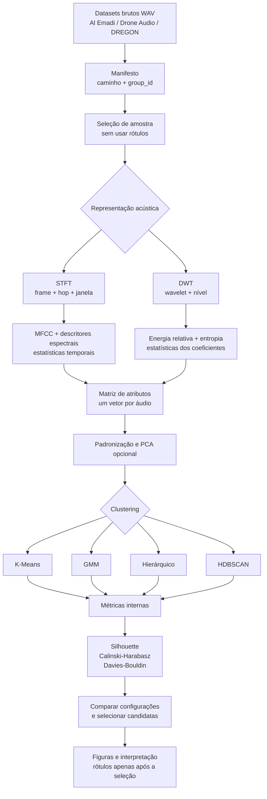

# Arquitetura experimental

Cada caminho entre `D` e `I` é um experimento de representação. Rótulos
conhecidos não são usados para construir atributos, formar clusters ou escolher
a configuração; podem apenas contextualizar os resultados ao final.
